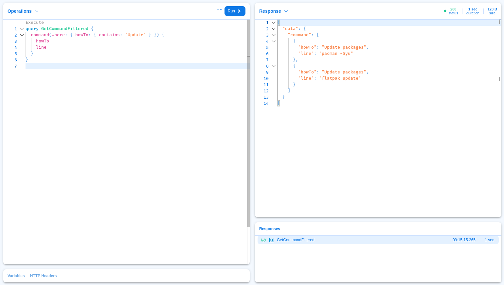
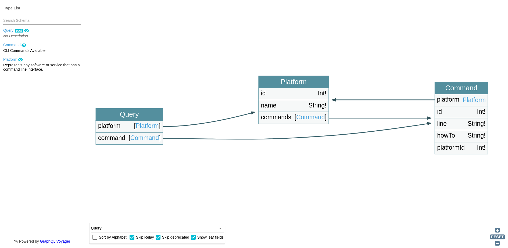

# CLI Store

This is a GraphQL server built with [dotNet 5](https://dotnet.microsoft.com/download) using the [Hot Chocolate framework](https://chillicream.com/docs/hotchocolate)

## Usage

You may start a Postgress database,a PGAdmin and the server itself with the included `dockercompose` file.

```console
docker-compose up
```
_Note:_ This will use port 8080, 8081 and 5000 for each container.

You may also cd into the server directory and modify the connection string located at `launchSettings`

```console
dotnet run
```

Visit the "Banana Cake Pop" GraphQL playground at http://localhost:5000/graphql



_Note:_ Postman collection included in project files, Insomnia is recommended for better GraphQL support.

Explore the schema with [GraphQL Voyager](https://github.com/APIs-guru/graphql-voyager) at http://localhost5000/graphql-voyager



## Todo

- [x] Dockerize server app.
- [x] Add server image to docker-compose.
- [ ] Nextjs frontned.